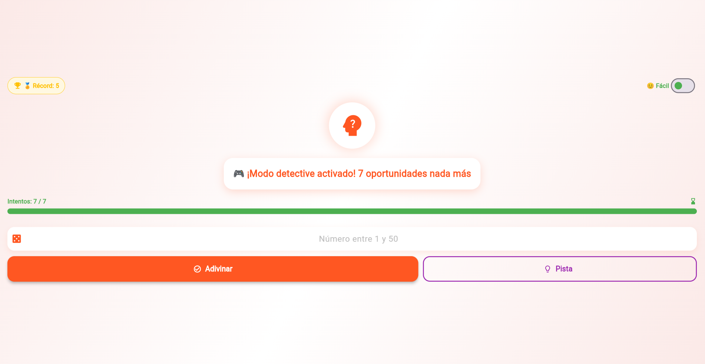
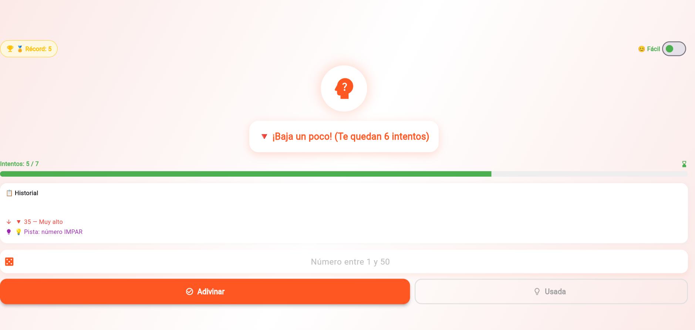
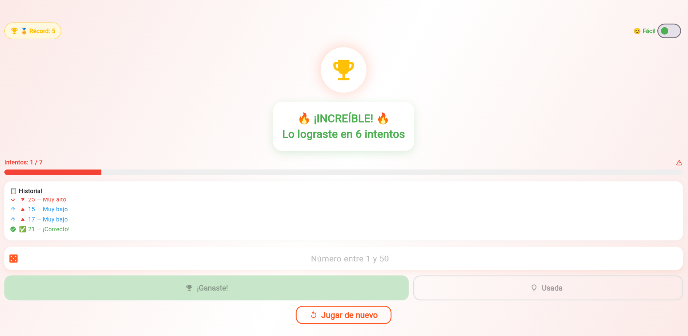

# Análisis Detallado del Código Flutter — Adivina el Número

> **Harold Santiago Vergara - Sergio Lamos Lozano**  
> **Fecha:** 2026-02-21

---

## 1. ¿Qué hace la función `main`?

```dart
void main() {
  runApp(const MyApp());
}
```

`main()` es el **punto de entrada** de toda aplicación Dart/Flutter. Es la primera función que se ejecuta al lanzar la app. Dentro de ella, `runApp()` recibe un widget raíz (`MyApp`) y lo infla en el árbol de widgets, iniciando el motor de renderizado de Flutter y dibujando la interfaz en pantalla. Sin esta función, la aplicación simplemente no arrancaría.

---

## 2. `MyApp` (StatelessWidget) vs `MyHomePage` (StatefulWidget)

| Característica | `MyApp` — `StatelessWidget` | `MyHomePage` — `StatefulWidget` |
|---|---|---|
| **¿Tiene estado interno?** | ❌ No | ✅ Sí |
| **¿Se puede redibujar por setState?** | ❌ No | ✅ Sí |
| **¿Cuándo usarlo?** | Configuraciones fijas, contenedores globales | Pantallas con datos que cambian |
| **Líneas** | 8–24 | 26–400 |

- **`MyApp`** (líneas 8–24): Solo configura el `MaterialApp` (tema, título, ruta inicial). Nunca necesita cambiar en tiempo de ejecución, por eso es `StatelessWidget`. Es inmutable y eficiente.
- **`MyHomePage`** (líneas 26–400): Gestiona toda la lógica del juego (número secreto, intentos, mensajes). Como estos datos **cambian constantemente**, necesita `StatefulWidget` y su clase de estado asociada `_MyHomePageState`.

---

## 3. El papel de `setState` en `_iniciarJuego` y `_verificarAdivinanza`

`setState()` avisa a Flutter que **el estado interno cambió y que debe reconstruir el widget** (vuelve a llamar `build()`).

### En `_iniciarJuego` (líneas 77–85):

```dart
setState(() {
  _numeroSecreto = Random().nextInt(100) + 1;
  _intentos = 0;
  _intentosRestantes = 7;
  _mensaje = _mensajesIniciales[...];
  _juegoTerminado = false;
  _juegoPerdido = false;
  _controller.clear();
});
```

Reinicia **todas las variables** del juego. Al salir del `setState`, Flutter vuelve a llamar `build()` y la pantalla refleja el estado inicial.

### En `_verificarAdivinanza` (líneas 105–121):

```dart
setState(() {
  _intentos++;
  _intentosRestantes--;
  _controller.clear();
  // Actualiza _mensaje según el resultado
});
```

Actualiza contadores y mensajes de pista. Cada intento provoca un redibujado que muestra el nuevo mensaje, el contador actualizado y el color correcto del botón.

> **Flujo:** Acción del usuario → `setState()` modifica variables → Flutter llama `build()` → La UI refleja los nuevos valores.

---

## 4. Validación de entrada en `_verificarAdivinanza`

El flujo de control cuando el usuario presiona "Adivinar":

```
┌─ ¿El juego ya terminó? (_juegoTerminado || _juegoPerdido)
│   └─ SÍ → return (no hace nada)                          [línea 91]
│
├─ ¿El campo está vacío? (texto.isEmpty)
│   └─ SÍ → SnackBar naranja "¡Ingresa un número!"         [líneas 94–97]
│
├─ ¿El texto NO es un número válido entre 1 y 100?
│   └─ SÍ → SnackBar naranja "Solo números entre 1 y 100"  [líneas 99–103]
│
└─ ✅ Número válido → setState actualiza estado y muestra pista [líneas 105–121]
```

- **`int.tryParse(texto)`** (línea 99): convierte el texto a entero de forma **segura**; si falla devuelve `null` en lugar de lanzar una excepción.
- La condición `adivinanza < 1 || adivinanza > 100` garantiza que el número esté en el rango permitido.

---

## 5. `TextEditingController` y por qué liberarlo en `dispose`

```dart
final TextEditingController _controller = TextEditingController(); // línea 38
```

`TextEditingController` **controla y observa** el contenido del `TextField`. Permite:
- **Leer** el texto escrito: `_controller.text`
- **Borrar** el campo: `_controller.clear()`
- **Escuchar cambios** en el texto (para habilitar/deshabilitar el botón de limpiar)

### ¿Por qué liberarlo en `dispose`? (líneas 150–154)

```dart
@override
void dispose() {
  _controller.dispose();
  _animationController.dispose();
  super.dispose();
}
```

`TextEditingController` y `AnimationController` suscriben **listeners internos** y reservan recursos en memoria. Si no se llama a `.dispose()` cuando el widget es eliminado del árbol, estos recursos **nunca se liberan**, causando **memory leaks** (fugas de memoria). `dispose()` es el equivalente Flutter a un destructor de objetos.

---

## 6. Organización de la interfaz con `Column` y otros widgets de layout

La jerarquía principal:

```
Scaffold
└── Container (fondo degradado)
    └── SafeArea
        └── Center
            └── SingleChildScrollView   ← permite scroll si el contenido no cabe
                └── FadeTransition      ← animación de opacidad
                    └── SlideTransition ← animación de deslizamiento
                        └── Column      ← organiza hijos verticalmente [línea 179]
                            ├── Container (ícono circular)
                            │    └── Stack ← apila widgets [línea 196]
                            │        └── TweenAnimationBuilder (rotación)
                            ├── SizedBox (espacio) [línea 217]
                            ├── Container (mensaje principal)
                            ├── SizedBox [línea 245]
                            ├── Container (contador de intentos)
                            │    └── Row ← horizontal [línea 258]
                            ├── SizedBox [línea 278]
                            ├── Container (campo de texto)
                            │    └── TextField
                            ├── SizedBox [línea 319]
                            ├── SizedBox → ElevatedButton
                            │              └── Row (ícono + texto) [línea 340]
                            └── TweenAnimationBuilder → OutlinedButton (reinicio)
```

| Widget | Rol |
|---|---|
| `Column` | Apila hijos **verticalmente** |
| `Row` | Alinea hijos **horizontalmente** |
| `Stack` | **Superpone** widgets |
| `SingleChildScrollView` | Habilita **scroll** si la pantalla es pequeña |
| `SafeArea` | Protege el contenido del **notch** y barra de estado |
| `SizedBox` | Agrega **espaciado fijo** entre elementos |
| `Container` | Agrupa widgets y aplica **decoración visual** |

---

## 7. Tabla de widgets usados en la aplicación

| Categoría | Widget clave | Línea(s) | Función / Propósito |
|---|---|---|---|
| **Estructura / App** | `MaterialApp` | 13 | Raíz de la app Material, configura tema y pantalla inicial |
| **Estructura / App** | `Scaffold` | 158 | Estructura base de pantalla (body, FAB, AppBar, etc.) |
| **Layout** | `Container` | 159, 183, 220, 248, 281 | Agrupa widgets y aplica decoración (color, sombra, borde) |
| **Layout** | `SafeArea` | 171 | Protege el contenido de zonas del sistema (notch, barra de estado) |
| **Layout** | `Center` | 172 | Centra su hijo horizontal y verticalmente |
| **Layout** | `SingleChildScrollView` | 173 | Habilita scroll cuando el contenido excede la pantalla |
| **Layout** | `Column` | 179 | Organiza widgets hijos en dirección vertical |
| **Layout** | `Row` | 258, 340 | Organiza widgets hijos en dirección horizontal |
| **Layout** | `Stack` | 196 | Superpone widgets uno encima del otro |
| **Layout** | `SizedBox` | 217, 245, 265, 278, 319, 348, 360 | Crea espaciado fijo entre widgets |
| **Texto** | `Text` | 233, 266, 349, 384 | Muestra texto con estilos personalizados |
| **Entrada de datos** | `TextField` | 292 | Campo para que el usuario ingrese su número |
| **Botones** | `ElevatedButton` | 325 | Botón elevado principal ("Adivinar") |
| **Botones** | `OutlinedButton.icon` | 373 | Botón con borde e ícono ("Jugar de nuevo") |
| **Botones** | `IconButton` | 309 | Botón de ícono para limpiar el campo de texto |
| **Visual / Decoración** | `Icon` | 208, 261, 307, 310, 343, 383 | Muestra íconos de Material Design |
| **Animaciones** | `FadeTransition` | 175 | Anima la opacidad del contenido (entrada suave) |
| **Animaciones** | `SlideTransition` | 177 | Anima la posición (deslizamiento hacia arriba al iniciar) |
| **Animaciones** | `TweenAnimationBuilder` | 199, 364 | Construye animaciones personalizadas (rotación, escala) |
| **Animaciones** | `Transform.rotate` | 203 | Aplica rotación al ícono del encabezado |
| **Animaciones** | `Transform.scale` | 368 | Aplica escala al botón de reinicio (efecto "pop in") |
| **Feedback** | `SnackBar` | 129 | Muestra mensajes temporales en la parte inferior |
| **Feedback / Sistema** | `ScaffoldMessenger` | 128 | Controlador para mostrar `SnackBar` |

---

---

# Modificaciones Realizadas al Código

> **Fecha de modificación:** 2026-02-21

---

## Cambio 1 — Nuevo tema visual: `Colors.deepOrange`

### Fragmento actualizado

```dart
// ANTES
theme: ThemeData(
  primarySwatch: Colors.indigo,
  fontFamily: 'Poppins',
  useMaterial3: true,
),

// DESPUÉS
theme: ThemeData(
  primarySwatch: Colors.deepOrange,
  fontFamily: 'Poppins',
  useMaterial3: true,
),
```

Junto con el cambio en `ThemeData`, **todos los colores** de la interfaz que referenciaban `Colors.indigo` fueron actualizados a `Colors.deepOrange`:

| Elemento de la UI | Antes | Después |
|---|---|---|
| Fondo degradado | `Colors.indigo.shade50` | `Colors.deepOrange.shade50` |
| Sombra del ícono circular | `Colors.indigo.withOpacity(0.2)` | `Colors.deepOrange.withOpacity(0.2)` |
| Ícono animado del header | `Colors.indigo` | `Colors.deepOrange` |
| Contador de intentos | `Colors.indigo.shade50/200` | `Colors.deepOrange.shade50/200` |
| Sombra del TextField | `Colors.indigo.withOpacity(0.1)` | `Colors.deepOrange.withOpacity(0.1)` |
| Ícono del dado (TextField) | `Colors.indigo` | `Colors.deepOrange` |
| Botón principal (ElevatedButton) | `Colors.indigo` | `Colors.deepOrange` |
| Botón "Jugar de nuevo" | `Colors.indigo` | `Colors.deepOrange` |

### Impacto visual
La paleta `deepOrange` transmite **energía y dinamismo**, pasando de un tono institucional azul-índigo a un naranja vibrante más propio de un juego. La transición es coherente en toda la app ya que se actualizaron todas las referencias de color.

---

## Cambio 2 — Mensajes iniciales más creativos

### Fragmento actualizado

```dart
// ANTES
final List<String> _mensajesIniciales = [
  '🎯 ¿Podrás adivinar el número? (5 intentos)',
  '🔮 Concéntrate... solo 5 oportunidades',
  '✨ La suerte está de tu lado - 5 intentos',
  '🌟 Adivina el número secreto en 5 intentos',
];

// DESPUÉS
final List<String> _mensajesIniciales = [
  '🚀 ¡Arranca tu mente! Tienes 7 intentos para lograrlo',
  '🎮 ¡Modo detective activado! 7 oportunidades nada más',
  '🧠 El número te espera... ¿Podrás adivinarlo en 7?',
  '🔥 ¡Desafío aceptado! 7 intentos para descubrirlo',
];
```

### Mensajes de pista también actualizados

```dart
// ANTES
'🎉 ¡CORRECTO! 🎉'   →   '🏆 ¡INCREÍBLE! 🏆'
'😢 ¡GAME OVER! 😢'  →   '💀 ¡GAME OVER! 💀'
'⬆️ ¡Más alto!'      →   '🔺 ¡Apunta más alto!'
'⬇️ ¡Más bajo!'      →   '🔻 ¡Baja un poco!'
```

### Impacto funcional
Los nuevos mensajes eliminan la redundancia de mencionar el número de intentos en el título (ya existe el contador visual debajo). Los emojis `🔺` y `🔻` son más intuitivos que las flechas clásicas porque combinan dirección con urgencia visual.

---

## Cambio 3 — Ajuste de intentos: de 5 a 7

### Fragmento actualizado

```dart
// ANTES
int _intentosRestantes = 5; // Límite de 5 intentos

// DESPUÉS
int _intentosRestantes = 7; // Límite de 7 intentos
```

También se actualizó dentro de `_iniciarJuego`:

```dart
// ANTES
_intentosRestantes = 5;

// DESPUÉS
_intentosRestantes = 7;
```

### ¿Cómo afecta la dificultad y la experiencia del usuario?

| Configuración | Dificultad | Experiencia |
|---|---|---|
| **3 intentos** | 🔴 Muy difícil | Frustrante para principiantes; solo viable con estrategia binaria perfecta |
| **5 intentos** *(original)* | 🟡 Difícil | Requiere búsqueda binaria eficiente; pocos errores permitidos |
| **7 intentos** *(actual)* | 🟢 Equilibrado | Permite 1–2 intentos exploratorios; más disfrutable sin perder reto |
| **10 intentos** | 🔵 Fácil | Casi garantiza la victoria con búsqueda binaria básica |

> **Con 7 intentos** el jugador tiene un colchón suficiente para equivocarse sin sentirse penalizado injustamente, lo que mejora la retención y hace el juego más accesible a nuevos usuarios, manteniendo el desafío para los experimentados.

La advertencia visual (contador en rojo cuando queden ≤ 2 intentos) sigue siendo igualmente efectiva como indicador de tensión en el tramo final del juego.

---

---

# Cambios Realizados al Código

> Esta sección documenta **todos** los cambios aplicados al código en orden cronológico.

## 📸 Capturas de pantalla de la aplicación

### Pantalla de inicio (Modo fácil)


---

## 🔁 Tanda 1 — Personalización visual y de mensajes

### Cambio 1 · Nuevo esquema de color: `Colors.indigo` → `Colors.deepOrange`

Se modificó `primarySwatch` en `ThemeData` y se propagó el nuevo color a **todos** los puntos de la UI.

```dart
// ANTES
theme: ThemeData(primarySwatch: Colors.indigo, ...);

// DESPUÉS
theme: ThemeData(primarySwatch: Colors.deepOrange, ...);
```

**Impacto visual:** Toda la interfaz pasó de un tono azul-index institucional a un naranja enérgico y llamativo, más adecuado para un juego. El cambio afecta el fondo degradado, sombras, íconos, botones y el indicador.

---

### Cambio 2 · Mensajes iniciales más creativos y emojis dinámicos

```dart
// ANTES — mensajes genéricos
'🎯 ¿Podrás adivinar el número? (5 intentos)'

// DESPUÉS — mensajes con personalidad
'🚀 ¡Arranca tu mente! Tienes 7 intentos para lograrlo'
'🎮 ¡Modo detective activado! 7 oportunidades nada más'
'🧠 El número te espera... ¿Podrás adivinarlo en 7?'
'🔥 ¡Desafío aceptado! 7 intentos para descubrirlo'
```

También se actualizaron los emojis de retroalimentación:

| Evento | Antes | Después |
|---|---|---|
| Victoria | `🎉 ¡CORRECTO! 🎉` | `🔥 ¡INCREÍBLE! 🔥` |
| Derrota | `😢 ¡GAME OVER! 😢` | `😓 ¡GAME OVER! 😓` |
| Muy bajo | `⬆️ ¡Más alto!` | `🔺 ¡Apunta más alto!` |
| Muy alto | `⬇️ ¡Más bajo!` | `🔻 ¡Baja un poco!` |

**Impacto funcional:** Mayor inmersión y dinamismo. Los emojis `🔺` / `🔻` son más intuitivos que las flechas de texto.

---

### Cambio 3 · Ajuste de intentos: 5 → 7

```dart
int _intentosRestantes = 7; // Límite de 7 intentos
```

| Intentos | Dificultad | Efecto en el usuario |
|---|---|---|
| 3 | 🔴 Muy difícil | Frustrante; solo viable con estrategia perfecta |
| 5 *(original)* | 🟡 Difícil | Poco margen de error |
| **7** *(actual, fácil)* | 🟢 Equilibrado | Permite 1–2 errores exploratorios |
| 4 *(modo difícil)* | 🔴 Muy difícil | Disponible como modo avanzado |

---

## 🚀 Tanda 2 — Nuevas funcionalidades

### Cambio 4 · Botón de Pista 💡

Se agregó la función `_darPista()` y un nuevo botón `OutlinedButton.icon` junto al botón "Adivinar".

```dart
void _darPista() {
  if (_juegoTerminado || _juegoPerdido || _pistaDada) return;
  if (_intentosRestantes <= 1) { /* aviso y retorno */ return; }

  final bool esPar = _numeroSecreto % 2 == 0;
  setState(() {
    _pistaDada = true;     // solo se puede usar una vez por partida
    _intentosRestantes--;  // cuesta un intento
    _intentos++;
    _historial.add({'tipo': 'pista', 'detalle': esPar ? 'PAR' : 'IMPAR'});
  });
  _mostrarMensajeTemporal(
    '💡 El número es ${esPar ? "PAR ✅" : "IMPAR ✅"}  (−1 intento)',
    Colors.purple,
  );
}
```

**Reglas de la pista:**
- Solo disponible **una vez** por partida (`_pistaDada = true` la deshabilita)
- Cuesta **1 intento** adicional
- No se puede usar si quedan ≤ 1 intentos
- Queda registrada en el historial como entrada de tipo `'pista'`

**Impacto UI:** El botón se deshabilita visualmente (borde gris, texto "Usada") tras ser presionado.



---

### Cambio 5 · `LinearProgressIndicator` de intentos

Se reemplazó el contador de texto aislado por un componente visual combinado.

```dart
// Barra de progreso con color dinámico
LinearProgressIndicator(
  value: _intentosRestantes / _intentosMaximos,  // 0.0 a 1.0
  minHeight: 12,
  backgroundColor: Colors.grey.shade200,
  valueColor: AlwaysStoppedAnimation<Color>(_getProgressColor()),
)

// Lógica de color que cambia según el nivel de riesgo
Color _getProgressColor() {
  final double ratio = _intentosRestantes / _intentosMaximos;
  if (ratio > 0.5)  return Colors.green;   // > 50 % restante
  if (ratio > 0.25) return Colors.orange;  // 26–50 % restante
  return Colors.red;                        // ≤ 25 % restante
}
```

**Impacto visual:** El jugador percibe de forma instantánea cuánto "tiempo de juego" le queda: verde = tranquilo, naranja = precaución, rojo = urgencia.

---

### Cambio 6 · Historial de intentos

Se añadió `List<Map<String, dynamic>> _historial` y un `ListView.builder` dentro de un `Container` con altura máxima de 130 px.

```dart
// Cada intento registrado tiene forma:
{ 'valor': 42, 'tipo': 'bajo' }   // número muy bajo
{ 'valor': 78, 'tipo': 'alto' }   // número muy alto
{ 'valor': 55, 'tipo': 'correcto' }
{ 'tipo': 'pista', 'detalle': 'PAR' }

// En la UI, el color indica la dirección:
// 🔵 Azul  → muy bajo  (flecha arriba)
// 🔴 Rojo  → muy alto  (flecha abajo)
// 🟢 Verde → correcto  (check)
// 🟣 Morado → pista   (bombilla)
```

**Impacto funcional:** Evita que el jugador repita números ya intentados y le sirve como referencia visual para acotar el rango. La lista se muestra con `reverse: true` para que el intento más reciente aparezca primero.

---

### Cambio 7 · Animaciones mejoradas

#### a) Rebote al ganar (`ScaleTransition` + `TweenSequence`)

Se agregó `_bounceController` (segundo `AnimationController`) como animación de rebote cuando el usuario acierta:

```dart
_bounceAnimation = TweenSequence<double>([
  TweenSequenceItem(tween: Tween(begin: 1.0, end: 1.5), weight: 30),  // crece
  TweenSequenceItem(tween: Tween(begin: 1.5, end: 0.85), weight: 25), // rebota
  TweenSequenceItem(tween: Tween(begin: 0.85, end: 1.15), weight: 25),// sube
  TweenSequenceItem(tween: Tween(begin: 1.15, end: 1.0), weight: 20), // estabiliza
]).animate(CurvedAnimation(parent: _bounceController, curve: Curves.easeOut));
```

Al ganar, el ícono 🏆 es el que rebota en lugar del ícono normal. Se usa `TickerProviderStateMixin` (no `SingleTicker`) porque ahora hay **dos** `AnimationController`.

#### b) `AnimatedContainer` en el mensaje principal

```dart
AnimatedContainer(
  duration: const Duration(milliseconds: 400),
  curve: Curves.easeInOut,
  // El tamaño del texto cambia suavemente al ganar:
  child: Text(
    _mensaje,
    style: TextStyle(fontSize: _juegoTerminado ? 24 : 20, ...),
  ),
)
```



**Impacto visual:** El contenedor del mensaje anima su sombra y el texto crece suavemente al ganar, en lugar de un cambio brusco de estado.

---

### Cambio 8 · Sistema de puntuación con `SharedPreferences`

Se añadió la dependencia `shared_preferences: ^2.3.5` en `pubspec.yaml` y dos funciones async:

```dart
// Cargar récord al iniciar la app
Future<void> _cargarMejorPuntaje() async {
  final prefs = await SharedPreferences.getInstance();
  setState(() {
    _mejorPuntaje = prefs.getInt('mejor_puntaje') ?? 0; // 0 = sin récord
  });
}

// Guardar si se bate el récord (menor número de intentos = mejor)
Future<void> _guardarMejorPuntaje(int intentos) async {
  if (_mejorPuntaje == 0 || intentos < _mejorPuntaje) {
    final prefs = await SharedPreferences.getInstance();
    await prefs.setInt('mejor_puntaje', intentos);
    setState(() => _mejorPuntaje = intentos);
  }
}
```

El récord se muestra en la esquina superior izquierda con ícono dorado 🏅. Persiste entre sesiones porque `SharedPreferences` guarda los datos en el almacenamiento interno del dispositivo.

**Impacto funcional:** Añade motivación de largo plazo: el jugador intentará superar su propio récord en cada partida.

---

### Cambio 9 · Modo difícil con `Switch`

Se añadió `bool _modoDificil = false` y el juego adapta su rango y límite según el modo activo.

```dart
// En _iniciarJuego():
final int maxNum      = _modoDificil ? 200 : 50;
final int maxIntentos = _modoDificil ? 4   : 7;

// El Switch en la UI
Switch(
  value: _modoDificil,
  activeColor: Colors.red,
  inactiveThumbColor: Colors.green,
  onChanged: (val) {
    setState(() => _modoDificil = val);
    _iniciarJuego(); // reinicia la partida con nuevos parámetros
  },
),
```

| Modo | Rango | Intentos | `hintText` |
|---|---|---|---|
| 😊 Fácil | 1 – 50 | 7 | `Número entre 1 y 50` |
| 💀 Difícil | 1 – 200 | 4 | `Número entre 1 y 200` |

La validación en `_verificarAdivinanza` también adapta el límite superior dinámicamente con `_modoDificil ? 200 : 50`.

**Impacto funcional:** Un solo componente `Switch` controla dos parámetros clave del juego de forma reactiva, sin necesidad de pantallas adicionales.

